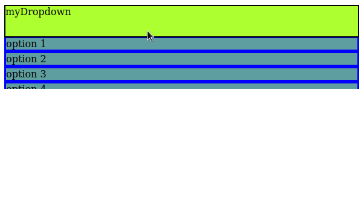

# dropdown_menu

## by nickslick03

dropdown_menu formats a dropdown menu from a container element, title element, and list element.

example:

**HTML**:

```
<div id="container">
    <div id="title">myDropdown</div>
    <ul id="list">
      <li>option 1</li>
      <li>option 2</li>
      <li>option 3</li>
      <li>option 4</li>
      <li>option 5</li>
      <li>option 6</li>
    </ul>
  </div>
```
**CSS**:

```
#title {
  height: 50px;
  border: 2px solid;
  background-color: greenyellow;
}

#list > li {
  border: solid blue; 
  background-color: cadetblue;
}
```


**JAVASCRIPT**:
```
formatDropdownMenu(document.getElementById('container'), document.getElementById('title'), document.getElementById('list'));
```


**RESULT**:

